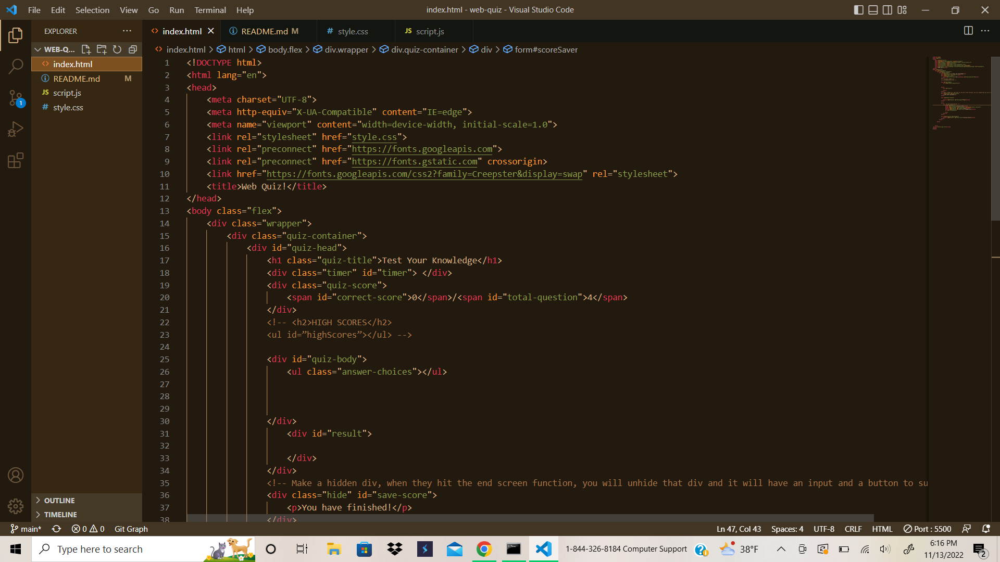
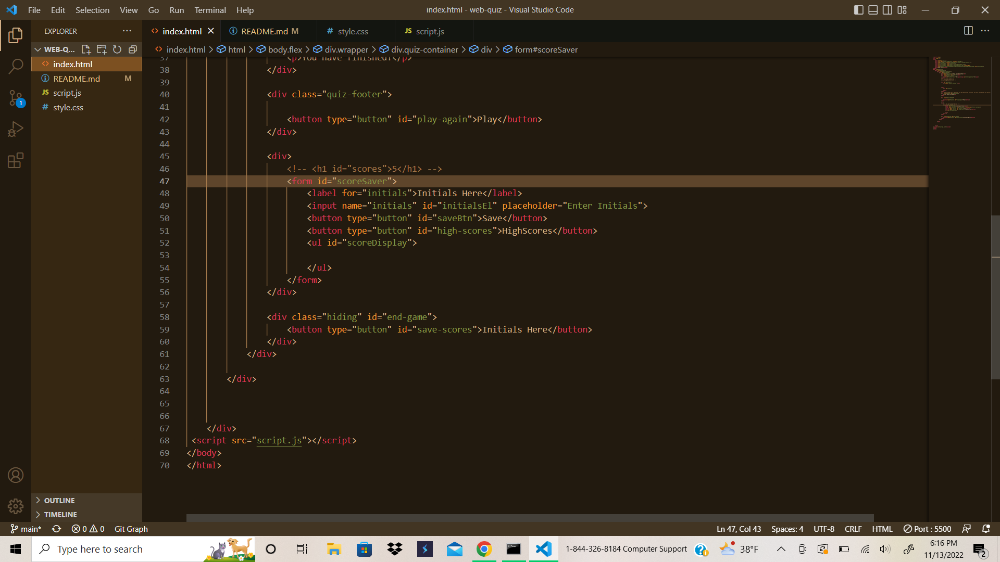
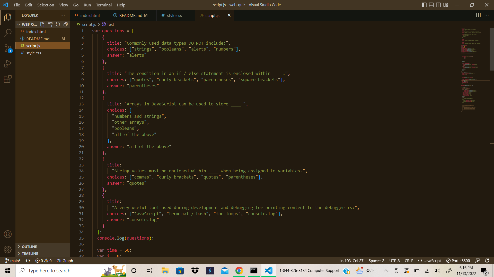
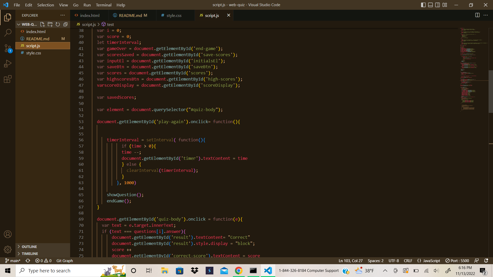
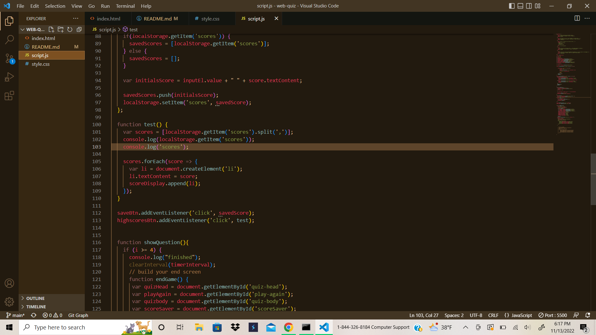
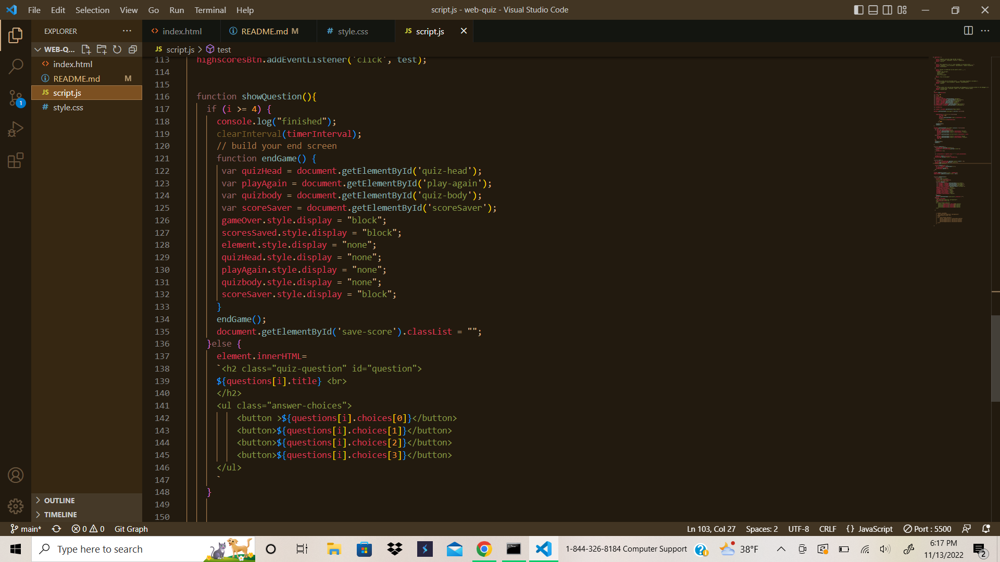
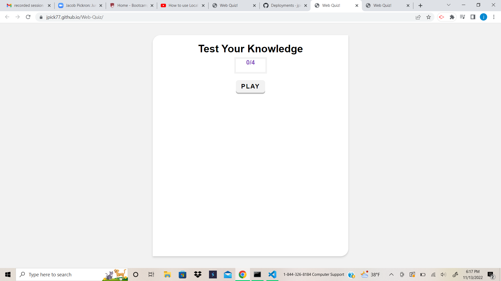
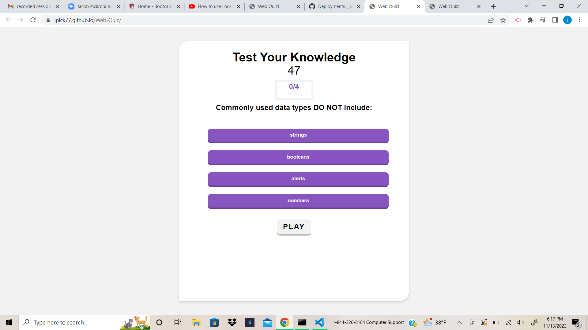
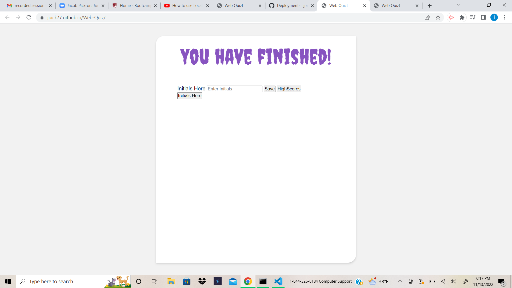

# Description
In this challenge I was tasked with making a quiz where users could test their knowledge about diffrent coding questions. First I set multiple diffrent var's one being the questions, answers, and the correct answer. Then I set a time interval, so when the user got to the last question the time would come to a stop. Then I made an "if" statement saying that if the user picked the right answer then they would get a correct promt and visa versa. Then if they got a question wrong it would take 5 minutes off the clock. I then created a local storage for the highscores. Finally I added a function saying that if the user answers the full 4 questons then "you are finished" message appears. Else then show the end game screen. I used hidden features to only display the end game scrren after the final question is answerd.

# Installation
I used basic javaScript and CSS to make this quiz. I used for loops to create the questions. I also used web API's to inplement the diffrent functions I wanted to preform.

# Link to Deployed Page
https://jpick77.github.io/Web-Quiz/

# Screenshots of Code and Website

